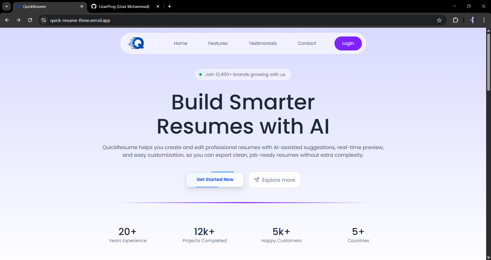
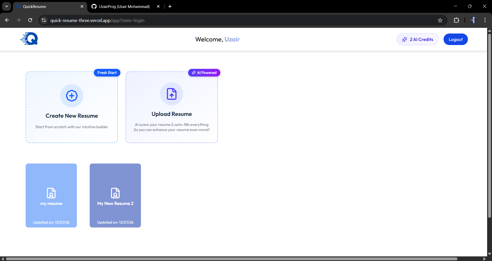

<div align="center">
  <h1>✨ QuickResume</h1>
  <h3>AI-Powered Professional Resume Builder</h3>
  <p>Create stunning, ATS-friendly resumes in minutes with AI assistance</p>

  <p>
    
    
    
    
    
  </p>

  <p>
    <a href="#live-demo"><strong>Live Demo</strong></a> •
    <a href="#features"><strong>Features</strong></a> •
    <a href="#getting-started"><strong>Get Started</strong></a> •
    <a href="#tech-stack"><strong>Tech Stack</strong></a>
  </p>
</div>

---

## 🚀 Live Demo

**🔗 [Try QuickResume Now](https://quick-resume-three.vercel.app/)**

> Transform your career journey with professional resumes built in minutes, not hours.

---

## 📸 Screenshots

<div align="center">
  
  <p><em>Dashboard - Manage all your resumes in one place</em></p>
  
  
  <p><em>Resume Builder - Intuitive form-based editing with live preview</em></p>
  
  
  <p><em>Multiple Professional Templates - Choose the perfect design for you</em></p>
</div>

---

## ✨ Features

### 🎨 **Professional Templates**
Choose from multiple beautifully designed, ATS-optimized resume templates that help you stand out.

### 🤖 **AI-Powered Content**
Get intelligent suggestions and content optimization to make your resume more impactful and professional.

### 📊 **Smart Dashboard**
Manage multiple resumes effortlessly with an intuitive, user-friendly dashboard interface.

### 👁️ **Real-Time Preview**
See your changes instantly as you edit, ensuring your resume looks perfect before downloading.

### 📥 **PDF Export**
Download your resume as a high-quality PDF file, ready to send to employers.

### 🔐 **Secure Authentication**
Your data is safe with secure user authentication and account management.

### 📱 **Fully Responsive**
Edit your resume on any device - desktop, tablet, or mobile - with a seamless experience.

### 🎯 **Structured Forms**
Step-by-step guided forms make it easy to input your information without missing important details.

---

## 🛠️ Tech Stack

<table>
<tr>
<td align="center" width="50%">

### Frontend
- ⚛️ **React** - Modern UI library
- ⚡ **Vite** - Lightning-fast build tool
- 🎨 **CSS3** - Custom styling & animations
- 🔄 **Redux** - State management
- 🔥 **Firebase** - Authentication services

</td>
<td align="center" width="50%">

### Backend
- 🟢 **Node.js** - JavaScript runtime
- 🚂 **Express.js** - Web framework
- 🍃 **MongoDB** - NoSQL database
- 🔧 **Mongoose** - Elegant MongoDB ODM
- 🖼️ **ImageKit** - Image management

</td>
</tr>
</table>

### Additional Services
- 🤖 **AI/ML APIs** - Intelligent content suggestions
- 📄 **PDF Generation** - High-quality resume exports
- ☁️ **Cloud Storage** - Secure file management

---

## 🚀 Getting Started

### Prerequisites

Make sure you have the following installed:
- **Node.js** (v14 or higher) - [Download here](https://nodejs.org/)
- **npm** or **yarn** - Package manager
- **MongoDB** - [Local installation](https://www.mongodb.com/try/download/community) or [MongoDB Atlas](https://www.mongodb.com/cloud/atlas)

### Installation

1️⃣ **Clone the repository**
```bash
git clone <repository-url>
cd QuickResume
```

2️⃣ **Install client dependencies**
```bash
cd client
npm install
```

3️⃣ **Install server dependencies**
```bash
cd ../server
npm install
```

4️⃣ **Set up environment variables**

Create a `.env` file in the `server` directory:
```env
MONGODB_URI=your_mongodb_connection_string
PORT=5000
JWT_SECRET=your_jwt_secret
AI_API_KEY=your_ai_api_key
IMAGEKIT_PUBLIC_KEY=your_imagekit_public_key
IMAGEKIT_PRIVATE_KEY=your_imagekit_private_key
IMAGEKIT_URL_ENDPOINT=your_imagekit_url
```

Create a `.env` file in the `client` directory:
```env
VITE_API_URL=http://localhost:5000
VITE_FIREBASE_API_KEY=your_firebase_api_key
VITE_FIREBASE_AUTH_DOMAIN=your_firebase_auth_domain
VITE_FIREBASE_PROJECT_ID=your_firebase_project_id
```

### Running the Application

**Development Mode:**

Open two terminal windows:

```bash
# Terminal 1 - Start Backend
cd server
npm run dev

# Terminal 2 - Start Frontend
cd client
npm run dev
```

Visit `http://localhost:5173` in your browser 🎉

**Production Build:**
```bash
# Build frontend
cd client
npm run build

# Start production server
cd ../server
npm start
```

---

## 📁 Project Structure

```
QuickResume/
├── client/                     # React frontend
│   ├── public/                # Static assets
│   ├── src/
│   │   ├── app/              # Redux store & slices
│   │   ├── components/       # Reusable UI components
│   │   │   ├── Dashboard/   # Dashboard components
│   │   │   ├── Forms/       # Form components
│   │   │   ├── Home/        # Landing page components
│   │   │   ├── Preview/     # Resume preview
│   │   │   └── templates/   # Resume templates
│   │   ├── configs/         # Configuration files
│   │   ├── pages/           # Page components
│   │   ├── App.jsx          # Main app component
│   │   └── main.jsx         # Entry point
│   ├── package.json
│   └── vite.config.js
│
├── server/                    # Express backend
│   ├── config/              # Configuration files
│   ├── controllers/         # Route controllers
│   ├── middlewares/         # Custom middlewares
│   ├── models/              # Mongoose models
│   ├── routes/              # API routes
│   ├── uploads/             # File uploads
│   ├── server.js            # Entry point
│   └── package.json
│
└── README.md
```

---

## 🎯 Key Features Explained

### Multi-Template System
QuickResume offers four distinct resume templates:
- **Modern Template** - Bold and contemporary design
- **Classic Template** - Traditional and professional
- **Minimal Template** - Clean and distraction-free
- **Minimal with Image** - Professional with photo

### AI-Powered Assistance
Leverage artificial intelligence to:
- Generate professional summaries
- Optimize job descriptions
- Suggest skill keywords
- Improve content clarity

### Seamless Resume Management
- Create unlimited resumes
- Duplicate and modify existing resumes
- Organize by job application
- Quick access dashboard

---

## 🎓 Learning Outcomes

Building QuickResume provides hands-on experience with:

- ✅ Full-stack MERN development
- ✅ RESTful API design and implementation
- ✅ Authentication & authorization flows
- ✅ Form validation and state management
- ✅ File upload and management
- ✅ PDF generation and processing
- ✅ Responsive UI/UX design
- ✅ Database modeling and relationships
- ✅ AI API integration
- ✅ Cloud services integration

---

## 🤝 Contributing

Contributions make the open-source community an amazing place to learn and create! Any contributions you make are **greatly appreciated**.

1. Fork the Project
2. Create your Feature Branch (`git checkout -b feature/AmazingFeature`)
3. Commit your Changes (`git commit -m 'Add some AmazingFeature'`)
4. Push to the Branch (`git push origin feature/AmazingFeature`)
5. Open a Pull Request

---

## 📝 License

This project is licensed under the **MIT License** - see the LICENSE file for details.

---

## 👨‍💻 Author

**Your Name**
- GitHub: [@UzairProg](https://github.com/UzairProg)
- LinkedIn: [@UzairMd](https://www.linkedin.com/in/uzair-md-4507892ba/)

---

## 🙏 Acknowledgments

- Thanks to all contributors who helped build this project
- Inspired by the need for accessible, professional resume creation tools
- Built with ❤️ and lots of ☕

---

<div align="center">
  <p>⭐ Star this repo if you find it helpful!</p>
  <p>Made with ❤️ by developers, for developers</p>
</div>
